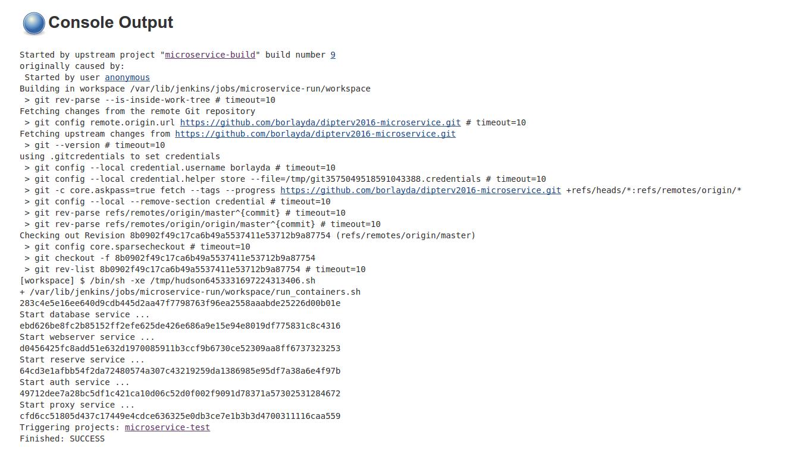

Minta alkalmazás elkészítése
============================

A megvalósításhoz felhasznált technológiák a szolgálatatások felismerésében
különböztek. Kipróbáltam a korábbi félévek során használt *Consul*-t, amivel
dinamikusan esemény vezérelten képesek kommunikálni a szolgálatatások.
Másodszorra a *Docker* konténerekbe beépített módzsert használtam fel, amivel
könnyen, már indítás közben felismerik egymást a szolgáltatások.
Harmadszorra pedog egy gyakran használt service registry-t használtam, az
*Apache Zookeepert*.

Megvalósítás Docker konténerekkel:
----------------------------------

Az egyszerűség kedvéért, és a koncepció kipróbálásához Docker konténereket
használtam, mivel ezek könnyedén elindíthatók, kkonfigurálhatók, és helyi gépen
is lehetővé teszik egy komplex architektúra kipróbálását.

A mikro szolgáltatások egyik legnagyobb előnye, hogy különböző platformokat és
programozási nyelveket használhatunk az architektúrában különösebb probléma
nélkül. Ezt a Docker-el úgy oldottam meg, hogy Centos és Ubuntu disztribúciójú
környezeteket, és PHP, Python, Java, illetve Bash szkripteket használtam.

A szolgáltatásokhoz tartozó Docker konténerek:

* **Adatbázis**: Az alapja egy *'mysql'* nevezetű konténer, ami tartalmaz egy
  lightweight Ubuntu-t és benne telepítve egy mysql szervert. Ezt a konténert
  egy inicializáló szkripttel egészítettem ki, ami elkészítette az alap
  adatbázist.
* **Terhelés elosztó**: A terhelés elosztást *HAProxy*-val oldottam meg, amit egy
  Ubuntu konténerre alapoztam. Létezik egy olyan Docker konténer, ami
  kifejezetten HAProxy mikro szolgáltatásnak van nevezve, azonban ez a konténer
  nehezen használható, és a szolgáltatás újraindítása is el lett rontva benne,
  így egyszerűbbnek láttam egy saját megvalósítást használni.
* **Webkiszolgáló**: A weboldal kiszolgálását egy *'httpd'* nevű lightweight konténer
  szolgálja ki amiben egy apache webkiszlgáló van. Ezt kiegészítettem *PHP*-val,
  és néhány szkripttel, ami kiszolgálja a kéréseket.
* **Authentikáció**: Egyszerű Ubuntu konténer, ami fel van szerelve *Python*-nal, és
  a *MySQLdb* Python könyvtárral. Ezen felül tartalmaz egy REST-es kiszolgálót,
  amin keresztül elérhető a szolgáltatás.
* **Vásárlás**: Centos konténer alapú környezet, amiben *Java* lett telepítve, és egy
  webes REST API-n keresztül érhetjük el a szolgáltatását.

Kapcsolatok építése Consul-al:
-----------------------------

A Consul alkalmazást korábbi félév folyamán használtam már, teljesítmény mérések
futtatására, így megpróbáltam átültetni a logikát a jelenlegi mikro
szolgáltatásokat biztosító architektúrába.
A gondot az okozta, hogy a Consul alkalmazásnak szükséges egy fix pont, és ehhez
találnom kellett egy olyan elemet, ami mindenképpen elsőnek indul el.
Ez az elem lett a proxy szerver, ami összefogja az elemeket. A korábbi félévben
használt kód megfelelő volt számomra, mivel nagyon hasonló minta alkalmazást
használtam a teljesítmény mérésekhez is.

Ez a megoldás nem elég elosztott a mikro szolgáltatások tekintetében, azonban
egy elág hatékony, és könnyen implementálható megoldás. A mikro szolgáltatásokra
épülő architektúréban jellemzően van egy Service Registry elem, ami lehetővé
teszi a szolgáltatások nyílvántartását, és ez biztosíthatja a kapcsolatot is.
A Consul ebben a kialakításban pontosan így is működött, viszont található olyan
eszköz amit kifejezetten a szolgáltatásokhoz találtak ki. Ez lenne például az
Apache Zookeeper.

Kapcsolatok építése Docker-el:
-----------------------------

Ahogy korábban már említettem lehetőség van a Docker legújabb verzióiban megadni
,hogy ez egyes konténerek milyen néven és milyen hálózaton keresztül érhető el
a többi konténer. A név beállításához a docker run parancs `--hostname`
paraméterét használhatjuk, míg a hálózat definiálásához előbb létre kell hozni
egy új Docker hálózatot
```{docker}
  docker network create bookstore
```
amire a konténerek tudnak csatlakozni a `--net` kulcsszóval. Ennek segítségével
elértem, hogy nagyon egyszerűen és egy eszköz felhasználásával képesek legyenek
látni egymást a szolgáltatások, viszont egy nagy hátulütője van a megoldásnak,
mégpedig az, hogy egy gépen kell futnia az összes alkalmazásnak. Mivel ez egy
mikro szolgáltatásokra épülő architektúránál közel sem ideális, így ez csupán
fejlesztési, és reprezentatív jelleggel használható. (Mivel a labor célja, hogy
bemutassam az architektúra működését, ezért ez megfelel számomra)

Kapcsolatok építése Zookeeper-el:
---------------------------------

TODO: Kipróbálni a Zookepert

Automatizálás:
--------------

A mikro szolgáltatások architektúrájában a következő feladatokat lehet
automatizálni:

1. **Teszt alkalmazás build-elése**: Gyakran van szükség a szolgáltatást futtató
   fájlok és egyéb tartalmak fordítására (C, Java, bináris kép fájlok frodítása)
   , és ezeket a forrásokat könnyedén elkészíthetjük automatizáltan is, mielőtt
   a környezetet összeépítenénk.
2. **Teszt architektúra telepítése**: Az egyes szolgáltatásokat egy felügyelt
   környezetbe helyezve valamilyen környezeti konfigurációval együtt
   telepíthetjük (esetünkben Docker konténerekbe csomagolhatjuk), és az így
   kialakuló architektúrát használhatjuk fel a céljaunkra. (Esetünkben
   kialakítunk egy könyvesboltot)
3. **Teszt architektúra konfigurálása**: Van, hogy telepítés után nem elég magára
   hagyni a rendszert, és használni a szolgáltatásokat, de szükséges különböző
   beállításokat végrehajtani, hogy a megfelelő módon működjön az alkalmazás.
   Ilyen feladat lehet a szolgáltatásokhoz tartozó registry frissítése, vagy
   a futtató gépeken a rendelkezésre állás javítása, és egyéb biztonsági
   mechanizmusok alkalmazása. (Esetemben a Zookeeper felkonfigurálása lesz
   a feladat.)
4. **Teszt architektúra tesztelése**: Az éles futó architektúrán futtathatunk
   teszteket, amikkel megbizonyosodhatunk, hogy a rendszer megfelelően működik,
   és minden rendben van, átadható a megrendelőnek, vagy átengedhető a
   felhasználóknak. Ilyen teszt lehet az alkalmazás elemeinek a unit tesztelése,
   szolgáltatásonként funkció tesztek futtatása, a szolgáltatások kapcsolaihoz
   integrációs és rendszer tesztek futtatása, illetve a skálázás és egyéb
   teljesítményt befojásoló tényezőkhöz teljesítmény tesztek futtatása.
   (Esetemben unit teszteket fogok futtatni)

Jenkins Job-ok fejelesztése:
----------------------------

Az architektúra összeállításának automatizálását a Jenkins folytonos integrációt
támogató eszközt használtam, aminek segítségével egyszerű feladatok
létrehozásával, és bash parancsok futtatásával képes voltam fellőni egy teszt
környezetet.

A létrehozott feladatok (job-ok):


* **bookstore-build**: Ennek a feladata a forrásfájlok és a Docker konténerek
  felkészítése. Miután a job végzett, a teljes infrastruktúra elkészíthető
  Docker konténerekből.


* **bookstore-run**: Ennek a job-nak a feladata a Docker konténerek indítása,
  a szolgáltatások iniciaálizálása.



* **bookstore-clean**: Ennek a job-nak a feladata, hogy a környezet ki legyen
  tisztítva, és ne maradjon a tesztek után semilyen Docker konténer, vagy
  fordított fájl a munkaterületen (workspace).


* **bookstore-test**: Unit tesztek futtatása a feladata, de ide tartoznának a
  funkció és integrációs tesztek is, illetve a teljesítmény tesztek.

A Jenkins lehetővé teszi, hogy az egyes feladatok alfeladatokat hívjanak, és egy
komplex hierarchiát hozzanak létre. Ha bonyolultabb vagy részletesebb felbontást
szeretnék, csak fel kell vennem pár újabb feladatot, és meg kell hívnom egy
feladatból a többit.

Egyéb minta alkalmazások:
------------------------

KanBan board minta:

https://github.com/eventuate-examples/es-kanban-board

Archivematica minta:

https://www.archivematica.org/en/
