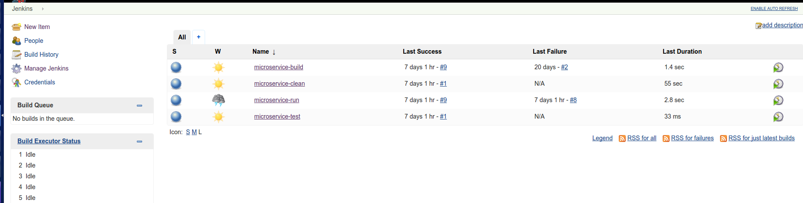
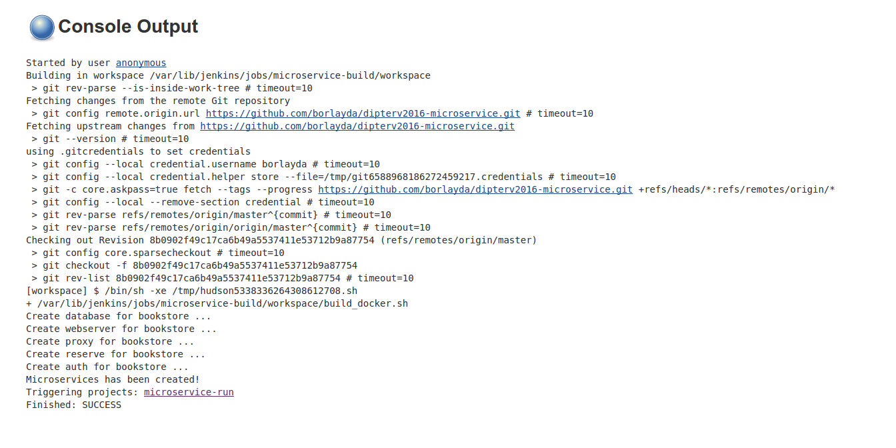
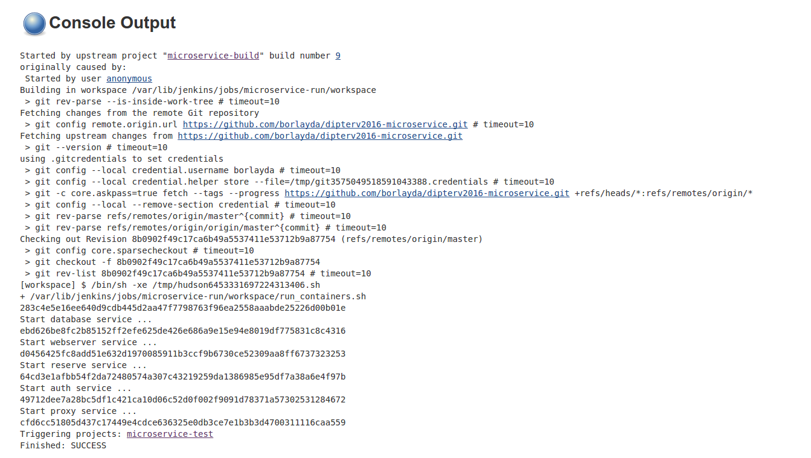
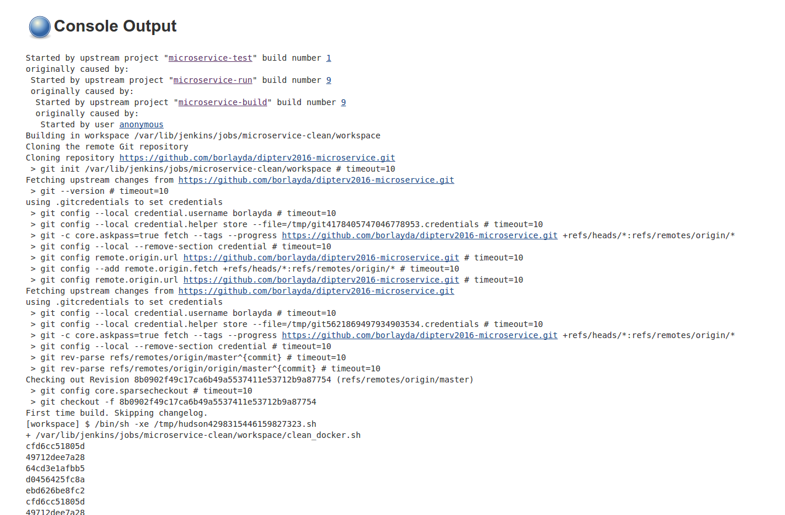

Automatizálás
=============

A mikroszolgáltatások architektúrájában a következő feladatokat lehet automatizálni:

1. **Teszt alkalmazás build-elése**: Gyakran van szükség a szolgáltatást futtató fájlok és egyéb tartalmak fordítására (C, Java, bináris kép fájlok frodítása), és ezeket a forrásokat könnyedén elkészíthetjük automatizáltan is, mielőtt a környezetet összeépítenénk.
2. **Teszt architektúra telepítése**: Az egyes szolgáltatásokat egy felügyelt környezetbe helyezve valamilyen környezeti konfigurációval együtt telepíthetjük (esetünkben Docker konténerekbe csomagolhatjuk), és az így kialakuló architektúrát használhatjuk fel a céljaunkra. (Esetünkben kialakítunk egy könyvesboltot)
3. **Teszt architektúra konfigurálása**: Van, hogy telepítés után nem elég magára hagyni a rendszert, és használni a szolgáltatásokat, de szükséges különböző beállításokat végrehajtani, hogy a megfelelő módon működjön az alkalmazás. Ilyen feladat lehet a szolgáltatásokhoz tartozó registry frissítése, vagy a futtató gépeken a rendelkezésre állás javítása, és egyéb biztonsági mechanizmusok alkalmazása. (Esetemben a Zookeeper felkonfigurálása lesz a feladat.)
4. **Teszt architektúra tesztelése**: Az éles futó architektúrán futtathatunk teszteket, amikkel megbizonyosodhatunk, hogy a rendszer megfelelően működik, és minden rendben van, átadható a megrendelőnek, vagy átengedhető a felhasználóknak. Ilyen teszt lehet az alkalmazás elemeinek a unit tesztelése, szolgáltatásonként funkció tesztek futtatása, a szolgáltatások kapcsolaihoz integrációs és rendszer tesztek futtatása, illetve a skálázás és egyéb teljesítményt befojásoló tényezőkhöz teljesítmény tesztek futtatása. (Esetemben unit teszteket fogok futtatni)

Jenkins Job-ok fejelesztése:
----------------------------

Az architektúra összeállításának automatizálását a Jenkins folytonos integrációt támogató eszközt használtam, aminek segítségével egyszerű feladatok létrehozásával, és bash parancsok futtatásával képes voltam fellőni egy teszt környezetet.

A létrehozott feladatok (job-ok):

* **bookstore-build**: Ennek a feladata a forrásfájlok és a Docker konténerek felkészítése. Miután a job végzett, a teljes infrastruktúra elkészíthető Docker konténerekből.

* **bookstore-run**: Ennek a job-nak a feladata a Docker konténerek indítása, a szolgáltatások iniciaálizálása.

* **bookstore-clean**: Ennek a job-nak a feladata, hogy a környezet ki legyen tisztítva, és ne maradjon a tesztek után semilyen Docker konténer, vagy fordított fájl a munkaterületen (workspace).

* **bookstore-test**: Unit tesztek futtatása a feladata, de ide tartoznának a funkció és integrációs tesztek is, illetve a teljesítmény tesztek.

A Jenkins lehetővé teszi, hogy az egyes feladatok alfeladatokat hívjanak, és egy komplex hierarchiát hozzanak létre. Ha bonyolultabb vagy részletesebb felbontást szeretnék, csak fel kell vennem pár újabb feladatot, és meg kell hívnom egy feladatból a többit.

Egyéb minta alkalmazások:
------------------------

KanBan board minta:

https://github.com/eventuate-examples/es-kanban-board

Archivematica minta:

https://www.archivematica.org/en/
