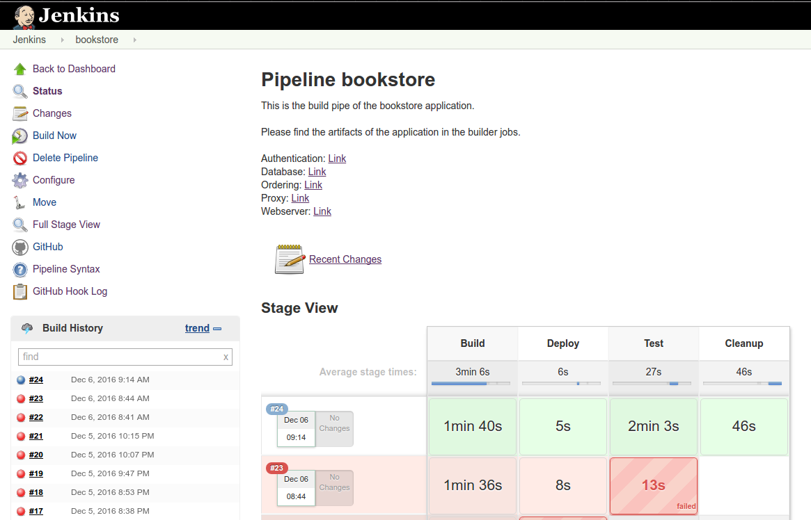

Automatizálás
-------------

Mint azt az előző fejezetben kifejtettem, sok haszna lehet, ha van valamilyen automatizált tesztelő, és integráló eszköz a mikroszolgáltatás alapú infrastruktúránk támogatására. Ahhoz, hogy teljes mértékben támogatni tudjuk a fejlesztés minden aspektusát, különböző módszereket, és alkalmazásokat tudunk használni.

###Kódolás tesztelése

Mivel folyamatosan készül új kód, és ennek a kódnak minőségileg és tartalmilag is helyesnek kell lennie, teszteket készíthetünk, amik még kezdeti fázisban elkapják a stillisztikai és kódolási hibákat. Ilyen lehet például a Git verzió kezelő esetén egy olya hook, ami leellenőrzi egy kód ellenőrzővel a szintaktikát (mint például Python kód esetén pylint alkalmazást futtatva), majd megvizonyosodik a szemantikáról is egy gyors unit teszt futtatással. Ez a megoldás egy azonnali választ ad a fejlesztőnek, hogy jól csinálja amit csinál, és vissza tartja a hibás kódrészleteket.

###Funkcionalitás tesztelése

Mivel minden konténer önálló alkalmazás, így az egyes alkalmazásokat magukban is lehet tesztelni, és lefedve az összes lehetséges felhasználási módot funkció teszteket futtathatunk. Ez a megoldás szintén lehet valamilyen verzió kezelőhöz kötve, vagy egy automatozáló eszközt felhasználva, tudunk eseményekre teszteket futtatni. Ez főleg abban segít, hogy ne kelljen értelmetlenül időt pazarolni a mikroszolgáltatás buildelésére, illetve az integrációra, ha meg tudjuk mondani, hogy nem megfelelő a szolgáltatás alapja.

###Interfész tesztek

Ez egy nehezebb kérdés, de hasznos lehet, ha valamilyen módon le tudjuk ellenőrizni, hogy a szolgáltatások közötti interfészek konzisztensek-e a régiekkel, és használhatók-e rendesen. Ez leginkább csak akkor kivitelezhető, ha jó leíró fájlokkal tudjuk megmondani, hogy milyen intefészek vannak az alkalmazásban. Ezzel a teszttel a cél az lenne, hogy ne tudja a fejlesztő csapatok közül egy se elrontani a többi szolgáltatás interfészével az konzisztenciát. Az automatizált megoldás a kódolás tesztek mellett futhat, hiszen erről is egy gyors visszajelzés a legcélravezetőbb.

###Teljes működés tesztje

Ez a legbonyolultabb művelet, amivel meg tudjuk mondani, hogy mindaz amit fejlesztettünk működik, együttműködik a többi szolgáltatással, és pontosan úgy működik ahogy szeretnénk. Sokan a pipeline terminológiát használják az ehhez hasonló funkcióhoz, ami annyit jelent, hogy a beadott adatokra egy kimeneti artifactot kapunk. A legáltalánosabb módszer, amit szinte mimnden felhasználásra rá lehet húzni, az egy buildelési folyamattal indul (építés), majd összeállít egy tesztelhető környezetet (telepítés), és végül a funkció teszteket, vagy integrációs teszteket (teszt) futtata. Ehhez a tesztelési stílushoz már kell egy olyan eszköz, amivel összehangoltan fel tudjuk építeni a teljes folyamot, és meg tudjuk oldani, hogy a végeredmény és a köztes információk elérhetők legyenek. Egy ilyen eszköz a folytonos integrációt támogató Jenkins, amiben könnyedén össze lehet állítani a megfelelő folyamot, hívási struktúrát. Természetesen ha szeretnénk csinálhatunk saját megoldást is, ami szkripttekkel és időzítő eszközökkel (például Bash és Cron) szintén megoldható.

Folytonos integrációs lépések tervezése
---------------------------------------

Mielőtt nekikezdtem volna a konkrét implementációnak, megnéztem, hogy miket is kéne végrehajtanom a saját pipeline-om futtatása során.

1. **Teszt alkalmazás build-elése**: Gyakran van szükség a szolgáltatást futtató fájlok és egyéb tartalmak fordítására (C, Java, bináris kép fájlok frodítása), és ezeket a forrásokat könnyedén elkészíthetjük automatizáltan is, mielőtt a környezetet összeépítenénk.
2. **Teszt architektúra telepítése**: Az egyes szolgáltatásokat egy felügyelt környezetbe helyezve valamilyen környezeti konfigurációval együtt telepíthetjük (esetünkben Docker konténerekbe csomagolhatjuk), és az így kialakuló architektúrát használhatjuk fel a céljainkra. (Esetünkben kialakítunk egy könyvesboltot)
3. **Teszt architektúra tesztelése**: Az éles futó architektúrán futtathatunk teszteket, amikkel megbizonyosodhatunk, hogy a rendszer megfelelően működik, és minden rendben van, átadható a megrendelőnek, vagy átengedhető a felhasználóknak. Ilyen teszt lehet az alkalmazás elemeinek a unit tesztelése, szolgáltatásonként funkció tesztek futtatása, a szolgáltatások kapcsolaihoz integrációs és rendszer tesztek futtatása, illetve a skálázás és egyéb teljesítményt befojásoló tényezőkhöz teljesítmény tesztek futtatása.

A korábbi félévek során találkoztam már a Jenkins eszközzel, és ennek megfelelően volt némmi tapasztalatom a használatával, azonban kijött belőle egy új verzió, ami sok új funkciót, és sok lehetőséget adott a hatékonyabb tervezésre.

Először is megpróbáltam megtervezni a feladatokat és végrehajtási sorrendet, az általam ismert Jenkins verzióban:

* **bookstore-build**: A forrásfájlok és a Docker konténerek felkészítése. Miután a job végzett, a teljes infrastruktúra elkészíthető Docker konténerekből.
* **bookstore-run**: Feladata a Docker konténerek indítása, a szolgáltatások iniciaálizálása.
* **bookstore-test**: Unit tesztek futtatása a feladata, de ide tartoznának a funkció és integrációs tesztek is, illetve a teljesítmény tesztek.
* **bookstore-clean**: Ennek a job-nak a feladata, hogy a környezet ki legyen tisztítva, és ne maradjon a tesztek után semilyen Docker konténer, vagy fordított fájl a munkaterületen (workspace).

Egymásra épülő feladatokat (job-okat) alakítottam ki, amik szépen sorban lettek végrehajtva. Ahogy az látható egy build készítette el az összes szolgáltatást, és a hozzájuk tartozó Docker konténert. Ha minden elkészült rendben, akkor egy alap infrastruktúra jött létre a konténerekből, majd teszteket futtathattunk, és végül felszámolva a minta környezetet törlődött minden. Amit ezzel szemben az új verzió nyújtott, az egy átfogó nézet a futó folyamatokról, és egy párhozamosan futtatható build szakasz, ami annyit jelent, hogy külön-külön egyesével készíthettem el a szolgáltatásokat, de mégis csak 1 build idejét kellett kivárnom. Mivel nem tudtam hogyan is lehetne jól tesztelni a folyamatot, és a tesztelés fázisa bármiből állhatna, ezért ezt a szakaszt kihagytam, de éles rendszeren ajánlott alkalmazni. Az új feladat rendszer tehát a következőképp nézett ki:

Az alkalmazáshoz több féle végeredmény is tartozik, mivel minden szolgáltatás önálló termékként funkcionál. Ennek megfelelően minden build eredménye mentődik a Jenkins-ben, és jól beazonosítható, minden futtatáshoz. Nagyon is hasznos lehet ez egy debug-olás, vagy hibakeresés során, mivel a környezetre szükség van a folyamatos ellenörzés közben, de a fejlesztő saját gépén kipróbálhatja pontosan ugyan azt az alkalmazást, amiben a hiba előfordult.

Az összefogó pipeline job-nak az az előnye, hogy látható mely szakasz mennyi ideig tart, és hogy melyik szakaszban történt hiba. A Jenkins lehetőséget ad egy saját Pipeline alkotó nyelv, ami a Groovy-n alapszik, és meg lehet vele hastározni, hogy pontosan mit és hogyan csináljon meg a folyam. A diplomatervben elkészített pipeline job-nak a szkriptje megtalálható a Függelékben.

Amit még ajánlott alkalmazni egy ilyen rendszer kiépítése során, az egy verzió kezelő alkalmazás, amit össze lehet kapcsolni a Jenkins-el, mivel sok verziókezelőhöz van támogatott feladat indító feltétel (trigger). Egy ilyen feltétel beállításai láthatók az \ref{jenkins-cred} és \ref{job-trigger} ábrákon.

Ez a változtatás lehetővé teszi, hogy a fejlesztők probléma menetesen, a folytonos integrációt támogató eszköz ismerete nélkül is képesek legyenek kihasználni annak előnyeit.

Folytonos Integrációt támogató rendszer elkészítése
---------------------------------------------------

Szerencsére könnyen és probléma mentesen tudtam dolgozni a Jenkins-el, ami főleg annak köszönhető, hogy a szakmai gyakorlatom, és akorábbi féléveim során is találkoztam vele. Az új funkciók nem lettek túlbonyolítva, így könnyen tudtam kezelni a Pipeline job-ot is, csupán rá kellett jönnöm, mely kulcsszavak mit csinálnak a konfigurációban. Ehhez sok hasznos információt ad a Jenkins ehhez tartozó honlapja[@jenkins-pipeline].
