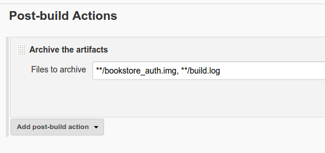

# Feladat implementációja

A minta alkalmazás implementálása során próbáltam a ma legnépszerűbb és leggyakrabban használt technológiákat használni, és a terveknek megfelelő legjobb megvalósítást.

## Felhasznált technológiák

A minta alkalmazás szolgáltatásaiban több kevert technológiát használtam, hogy be tudjam mutatni a mikroszolgáltatásokon alapuló alkalmazások legnagyobb erősségét, a kervert technológiás megvalósítást. A kiszolgálási logikát Python, Java és PHP nyelveken írtam, és használtam Apache webkiszolgáló alkalmazást, és Ngnix webkiszolgáló és reverse proxy szervert. A szolgáltatások futtatásához Bash szkripteket készítettem, és Docker konténereket használtam fel a környezetfüggetlenség eléréséhez. Az adatbázis kezelésére MySQL adatbázis kezelő szervert használtam, mivel ez a legelterjedtebb ingyenesen használható adatbázis kezelő.

Python nyelven nagyon egyszerű implementálni egy webkiszolgálót, amin keresztül a kiszolgáló interfészt elkészíthetem, illetve a program logika és adatbázis kapcsolat is könnyen megvalósítható, mivel rengeteg elkészített könyvtár áll rendelkezésemre. A Python egy széles körben felhasznált nyelv, így egy valós mikroszolgáltatás alapú alkalmazásba is nagy valószínűséggel belekerülne.

A Java egy platform függyetlen nyelv, amit mind kliens oldali alkalmazásokhoz, mind szerver alkalmazások elkészítéséhez is használják, és viszonylag öregebb nyelv amihez rengeteg típusú hálózati kommunikációs protokollt implementáltak, így könnyen és széles körben használható nyelv. Egy másik előnye a feladat szempontjából, hogy fordítás szükséges hozzá, és így a fordítási folyamatban egy jar állomány elkészítését is be tudom mutatni.

A PHP egy olyan dinamikus webkiszolgáló nyelv, amit már hosszú ideje használnak, és elég a feladathoz tartozó egyszerű webes böngésző felületet elkészítéséhez. Ezzel a nyelvel gyorsan tudok dolgozni, mivel korábban is találkoztam a nyelvvel.

Az Nginx a Java-s alkalmazások kiszolgálásához használt leggyakoribb webkiszolgáló szerver, az Apache webszerver pedig a statikus és dinamikus tartalmak kiszolgálásban gyakran használt eszköz.

A Docker a mikroszolgáltatások gyakran használt virtualizáló eszköze, amit gyors, és egyszerű használata teszi alkalmassá. A Docker álltal létrehozott virtuális konténer környezetben pontosan annyi van, amennyit a szolgáltatáshoz fel akarunk használni, de könnyen bővíthető, karbantartható, és kicserélhetők a konténerek.

A kommunikációhoz, és a szolgáltatások egymásra találásához a Consul szolgáltatás felderítő eszközt használtam, amivel már volt korábbi tapasztalatom. A Consul könnyen telepíthető, egyszerűen használható, és a piacon található más termékekkel ellentétben ingyenes, és gyorsan fejlődő eszköz. Minden funkciót tartalmaz amire szükségem van, és sokkal könnyebben bekonfigurálható, mint a mikroszolgáltatásoknál gyakran használt Apache Zookeeper.

## Szolgáltatások implementálás

Minden szolgáltatáshoz külön el kellett készítenem a környezetet, és a szolgáltatást futtató logikát, amit jól elkülöníthető módon tudtam véghez vinni.

### Docker konténerek

Szolgáltatásonként készítettem egy Docker image-et, amiből elindíthatók az alkalmlazás részei. Minden konténer egyedi, de vannak olyan részei amik minden szolgáltatáshoz szükségesek. Egy ilyen rész a Consul alkalmazás telepítése, és a konfiguráció bemásolása:

```{Dockerfile}
FROM ...

# Install consul
COPY consul consul-template /usr/bin/
RUN chmod +x /usr/bin/consul && \
    chmod +x /usr/bin/consul-template && \
    mkdir -p /etc/consul.d
COPY <service>.json /etc/consul.d/<service>.json
...
```

Az eszköz telepítése egy egyszerű fájl másolásból áll, és a jogosultságok beállítása után, már használható is. Minden szolgáltatáshoz tartozik egy JSON fájl, ami tartalmazza a szolgáltatás Consul-hoz kapcsolódó adatait, mint a felhasznált kommunikációs port, és a szolgáltatás megnevezése, kategorizálása.

Ami minden szolgáltatásnál különbözik, az a telepített alkalmazások listája, amik aszerint lettek meghatározva, hogy milyen függőségei vannak a szolgáltatást futtató programnak. Ez a rész a Docker image disztribúciójának megfelelő telepítő programmal történik. Az adatbázis kezelő esetében nem volt ennyire egyszerű a helyzet, ugyanis a **mysql-server** csomag telepítése, egy interaktív választ kér a felhasználótól, amit automatizáltan a következő módon tudunk megtenni:

```{Dockerfile}
FROM ...

RUN apt-get -y update && \
    /bin/bash -c "debconf-set-selections \
<<< 'mysql-server mysql-server/root_password password root'" && \
    /bin/bash -c "debconf-set-selections \
<<< 'mysql-server mysql-server/root_password_again password root'" && \
    apt-get -y install mysql-server
...
```

Minden Docker image készítésénél az első telepítéshez kellő parancs a repository frissítése, ami jelen esetben az **apt-get update**. Ha ezt nem tesszük meg akkor az alap image ismeretlenül régi csomaglistáját használjuk, ami azt eredményezi, hogy a telepítő nem talál csomagokat, illetve nem a jó verziót találja meg. A **debconf-set-selctions** egy olyan program ami lehetővé teszi, hogy a Debian csomagkezelő kérdéseire automatikusan tudjunk válaszolni.

Minden szolgáltatáshoz tartozik egy indító szkript, ami tartalmazza az alkalmazás többi elemének a megkeresését, és a szolgáltatás elindításához tartozó lépéseket. Az elkészült Dockerfile-ok amikkel az image-eket építettem, és az indító szkiptek megtalálhatók a függelékben (\ref{appendix-dockerfile}. és \ref{appendix-starter}. fejezet).

### Alkalmazás részletek

Minden szolgáltatáshoz tartozik egy vagy több forrásfájl, ami tartalmazza a kiszolgáló kódot. A kiszolgáló kód egy HTTP protokollal elérhető webkiszolgáló, mivel az általam választott Rest-es kommunikációhoz erre van szükség.

Az autentikációt lehetővé tevő szolgáltatás tartalmaz egy **Python Flask** implementációt, ami egy olyan webkiszolgáló Python könyvtár, amivel az egyes URL-eket metódusokhoz rendelhetjük. Ezen kívül egy adatbázis elérést tartalmaz, amit a **MySQLdb** modul segítségével implementáltam. Az egyszerűség kedvéért, az adatbázis már a kezdetektől fogva fel van töltve, és nem lehet bele új felhasználót felvenni. Ha valaki szerepel az adtbázisban, és a jelszava a neki megadott jelszó, akkor sikeresnek jelzem az autentikációt, egyébként "HTTP 401 Unauthorized" üzenettel jelzem a hibát.

Az adatbázishoz nem kellett külön szolgáltatás kódot írnom, mivel a MySQL adatbázis önmagában is képes kezelni a felé eső kéréseket. A szolgáltatást használat előtt töltöm fel adatokkal, amiken keresztül be tudom mutatni a működést. Az adatok betöltését kisebb SQL nyelven írt szkriptekkel írtam le. A könyvekhez tartozó adatbázis léterhozása például a következő képpen néz ki:

```{SQL}
...
CREATE TABLE store
(
	store_id int NOT NULL AUTO_INCREMENT,
	book_name varchar(255) NOT NULL,
	count int NOT NULL,
	PRIMARY KEY (store_id)
);
...
```

Ahogy látható a könyvekhez tartozik egy név és egy számosságot jelző "count" mező, illetve egy kulcs érték, amin keresztül minden könyv egyedien megkülönböztethető. A többi adattábla ehhez hasonlóan van elkészítve, és a hozzájuk tartozó kód megtekinthető a függelékben (\ref{appendix-database}. fejezet).

A böngészéshez tisztán PHP kódot írtam, amit az Apache HTTP szerver ajánl ki. Ezek a szkriptek teszik elérhetővé a felhasználó számára a szolgáltatásokat, egy nagyon egyszerű HTML oldalon keresztül. Az egyes funkciók magukban is elérhetők a saját kiszolgálójukon keresztül, de a PHP kódok egy közös felhasználói interfészt adnak, ami annyit tesz, hogy a PHP kódok tovább hívnak a szolgáltatások interfészeire. Ha kliens oldali alkalmazást készítettem volna, akkor a böngészéshez tartozó kód, egy grafikus felület kódja lett volna, ami pont ugyan így kommunikált volna a többi szolgáltatással. Ugyan így elmondható, hogy bármikor kicserélhető a megjelenítés a böngészés szolgáltatás kicserélésével. A PHP kódok megtalálhatók a függelékben (\ref{appendix-http}. fejezet).

A legbonyolultabb szolgáltatás a megrendeléshez tartozó szolgáltatás, ami az alábbi kódrészletet tartalmazza. Ennek megfelelően a program megkeresi a megrendelendő könyvet a nyilvántartásban, megnézi lehetséges-e a feladott megrendelés, és ha igen bejegyzéseket tesz róla az adatbázisban. Levonja a kívánt mennyiséget a jelenlegi mennyiségből, és felvesz egy új rendelést a rendelések jegyzékébe.

```{java}
...
selectStmt = this.conn.prepareStatement(
    "SELECT count FROM store WHERE book_name LIKE ?"
);
updateStmt = this.conn.prepareStatement(
    "UPDATE store SET count = ? WHERE book_name LIKE ?"
);
insertStmt = this.conn.prepareStatement(
    "INSERT INTO reservation (username, book_name, count, res_date)" +
    "VALUES (?, ?, ?, ?)"
);
this.logger.info("Get book list");
this.conn.setAutoCommit(true);
selectStmt.setString(1, nameOfBook);
if (selectStmt.execute()) {
   rs = selectStmt.getResultSet();
   rs.next();
   int count = rs.getInt("COUNT");
   count = count - number;
   if (count > 0){
     this.logger.info("Update books in database");
     updateStmt.setInt(1, count);
     updateStmt.setString(2, nameOfBook);
     updateStmt.executeUpdate();
     this.logger.info("Save the executed order");
     insertStmt.setString(1, "test");
     insertStmt.setString(2, nameOfBook);
     insertStmt.setInt(3, number);
     insertStmt.setString(4, new Date().toString());
     insertStmt.executeUpdate();
   } else {
     this.logger.info("Not enough book in the store!");
     status = 500;     
   }
}
...
```

A Proxy szolgáltatás az adatbázishoz hasonlóan nem igyénel önálló logikát, mivel a HAProxy, amit kiválasztottam mint proxy vezérlő, nem igényel semmilyen mögöttes logikát, csupán egy konfiguráció beállítást. Ezt a beállítást Consul template segítségével értem el, amit a következő módon konfiguráltam:

```{config}
...
frontend <servicename>
    bind *:<serviceport>
    default_backend <backendname>

backend <backendname>
    balance roundrobin{{range "app.<service>"}}
    service {{.ID}} {{.Address}}:{{.Port}}{{end}}
...
```

Minden szolgáltatáshoz tartozik egy ilyen bejegyzés, ami pontosan megmondja, hogy az adott szolgáltatáshoz melyik port tartozik, és hol találhatók a backend szerverei. A Consul template pedig kitölti a backend szerverhez tartozó részeket az összes élő szolgáltatáspéldánnyal. Ha egy szolgáltatás konténer leáll, akkor a hozzá rendelt bejegyzés automatikusan eltűnik. A konkrét Consul template megtalálható a függelékben (\ref{appendix-template}. fejezet).

## Kommunikáció

A szolgáltatások közötti kommunikáció Rest-es interfészeken keresztül történik, HTTP protokollal. Az interfészek minden szolgáltatásra egyediek, és csak egy olyan szolgáltatás van akinek mindegyik interfészt ismernie kell, ez pedig a böngészés, mivel ezen keresztül érhető el az összes funkció. Az egyes szolgáltatások nem tudnak egymásról, így kellett egy mechanizmus, ami megtalálja az összes szolgáltatást, és elérhetővé teszi egymás számára.

Ez a technológia a Consul lett, amihez ha beregisztrálunk egy végpontot, akkor minden adatát elérhetővé teszi a consul álltal létrehozott hálózaton belül. Egészen pontosan úgy történik ez, hogy létrehozunk egy Consul szervert, ami képes megosztani az adatokat a hozzá beregisztrált kliensekhez, illetve csatlakozhat más hálózatokhoz is, amikben ő mint kliens jelenik meg. Ezt kihasználva egy olyan logikát csináltam, ami minden végpontot Consul szerverként kezel, és automatikusan a legkisebb IP című másik szervert megtalálja.

```{bash}
...
while true; do
    FOUND=false
    for ADDR in $(seq 1 255); do
        echo "${MASK}.${ADDR}  ${IP_ADDR}"
        [[ "${MASK}.${ADDR}" == "${IP_ADDR}" ]] && continue
        ping -c 1  "${MASK}.${ADDR}"
        [ $? -eq 0 ] || continue
        echo "Try consul with ${MASK}.${ADDR}"
        consul agent -server \
                     -join "${MASK}.${ADDR}" \
                     -datacenter "bookstore" \
                     -data-dir "${CONSUL_DIR}" \
                       > /var/log/bookstore-consul.log &
        sleep 10
        cat /var/log/bookstore-consul.log
        if ps ax | grep -v grep | grep "consul" > /dev/null; then
            echo "Consul could run!!!"
            FOUND=true
            break
        fi
    done
    echo "${FOUND}"
    if [[ "${FOUND}" == "true" ]]; then
        break
    fi
done
...
```

Ha megtalálta egymást néhány szerver, akkor egyre több és több lehetőség lesz csatlakozni a hálózathoz, és bármely szerver kiesése esetén az össze szolgáltatás helyettesítheti a kiesőt. Ettől a consul hálózat hibatűtő lesz, és az adat is meg lesz osztva a végpontok között.

A pontos cím és a szolgáltatás is kinyerhető a Consul adatbázisából, így bármelyik funkió elérhetővé válik.

## Működés és alkalmazás

Az alkalmazás indításához elkészítettem egy elég általános indító szkriptet, ami a neki megadott Docker konténerekből indít el egy alkalmazást.

```{bash}
...
for service in ${services}
do
    echo "Start ${service} service ..."
    docker run -d --name "${service}" \
        -h "${service}" --net=bookstore bookstore_${service}
done
...
```

Miután elindult az alkalmazás, a webes felület elérhető a proxy, vagy a böngésző Docker konténer IP címén keresztül. Ehhez az információhoz a következő paranccsal juthatunk:

```{bash}
docker inspect -f '{{ .NetworkSettings...IPAddress }}' proxy
```

Ha valamilyen névfeloldás áll rendelkezésre, akkor a proxy szolgáltatás IP címét érdemes megadni neki. A felhasználó egy egyszerű bejelentkeztető felületet láthat az alkalmazás indítása után, amin keresztül a felhasználó nevet és jelszavat adhatja meg (\ref{login}. ábra).


Ha bejelentkeztünk, a böngésző oldalra dob az alkalmazás, és lehetőségünk nyilik rendeléseket is feladni (\ref{browse}. ábra).


A háttérben minden kérésünkre a szolgáltatások között kommunikáció indul meg, és a különböző funkciók esetén más-más szolgáltatás kiszolgáló kódja indul el.

## Folytonos integráció elkészítése

A folytonos integrációt támogató keretrendszerek közül a Jenkins-t választottam, mivel ez a legelterjedtebb nyílt forrású eszköz, amivel képes vagyok véghez vinni a feladatokat.

### Jenkins

A Jenkins egy olyan folytonos integrációt támogató keretrendszer, aminek a Java implementációja lehetővé teszi, hogy bármely, az eszközhöz beregisztrált gépen futtassunk tetszőleges kódot. Ahhoz, hogy ezeket a kódokat futtassuk, egy jól struktúrált végrehajtási rendszert implemenetál, aminek a következők a részei:

* Jenkins: A Jenkins maga a legnagyobb egység, ami az összes végrehajtandó feladatot tartalmazza, struktúrálja, és konfigurálhatóvá teszi a felhasznált plugin-eket, autentikációt, és mindent ami a feladatokhoz tartozhat.
* View: A feladatok egy jól struktúrált egysége.
* Job: Ez a feladatok implementációja, minden ilyen elem tetszőleges mennyiségű végrehajtandó feladatot tartalmaz, képes más Job-ok hívására, és a plugin-ek használatával gyakorlatilag bármilyen feladatot képes elvégezni (csomagolást futtat, java forrásokat fordít maven-nel, vagy Docker konténereket vezérel, stb.).
* Build: Ez az egység egy Job egyszeri futását jelenti, ehhez tartozik egy azonosító, ami az adott futtatást megkülönbözteti, a futtatás paraméterei, környezeti változói, és egy olyan szeparált környezet (workspace), amiben a feladatokat végrehajtja.

Ahhoz hogy megcsinálhassam az alkalmazásom fejlesztését támogató keretrendszert, ahhoz Job-kat kellett létrehoznom, amik végrehajtották a szoftverrel kapcsolatos feladatokat.

### Pipeline Job

A Pipeline Job egy olyan Jenkins 2.0-ban elérhető feladat fajta, ami képes egységbe szervezni a feladatokat, és levezényelni a közös futásukat. A legtöbb folytonos integrációt támogató rendszerben egy rövidebb, hosszabb munkafolyamatot kell lebonyolítani, aminek a pipeline nevet adta a Jenkins, mivel az egyes feladatok futtatásai az előzetes futások eredményétől függenek, ami annyit jelent, hogy például a telepítési fázis függ a fordítási fázis artifact-jaitól.

A Jenkins 2.0-ban megjelenő Pipeline Job-hoz tartozik egy új leíró nyelv is, amit Pipline szkriptnek neveznek. Lehetőség van fájlban tárolni a konfigurációt, amit Jenkinsfile néven lehet menteni. A Dockerfile-hoz hasonlóan ez is a működést írja le, és Pipeline szkriptet tartalmaz.

```{Pipeline}
...
node {
    echo 'Running '+jobName+' job'
    build job: jobName
}
...
```

A fenti részlet egy olyan Pipline szkriptet mutat, amiben egy bizonyos feladatot akarunk futtatni. A 'node' kulcsszó jelzi a gépet amin futtatni akarjuk a feladatot, aminek ha nem adunk meg semmit, akkor tetszőleges helyen fut le. A zárójelek között leírt utasítások pedig megmondják, mi történjen azon a végponton. Egy utasítás lehet bármi amit egy Jenkins álltal alapból támogatott Job esetén beállíthatnánk, de ezek a parancsok inkább arra vannak kiélezve, hogy a feladatok közötti kapcsolatot leírják. Az egyik ilyen parancs az **echo** amivel kiírhatunk a futtatás során üzeneteket a console kimenetre. Másik utasítás, a **build job**, amivel elindíthatunk egy 'Build'-et. Az alábbi példában egy fázis definiálása látható.

```{Pipeline}
stage 'Deploy'
echo 'Deploying services ...'
build job: 'deploy-services'
```

Egy fázis definiálása során egy képzeletbeli egységet alkotunk, ami Job-ok, illetve parancsok futtatását tartalmazza. Új fázist a **stage** kulcsszóval definiálhatunk, és az utána írt utasítások mind a fázis részeként fognak megjelenni.

Az általam implementált Pipeline Job, tartalmaz egy 'Build', egy 'Deploy', egy 'Test', és egy 'Cleanup' fázist. Az alábbi ábrán látható a Jenkins-beli feladathoz tartozó összefoglaló nézet, ahol láthatók a Job futtatásai:


A képen látható, hogy hogyan is választja szép a fázisokat a Pipiline Job, és hogy hogyan lehet kategorizálni a feladatok megívását. Az első 'Build' fázis mögött például 5 darab fordító feladat meghívását tartalmazza, ami azt jelenti, hogy minden szolgáltatást külön fordít le és készíti el a hozzá tartozó Docker image-et.

### Jenkins Job-ok a keretrendszerhez

Az előző fejezetben már látható volt, hogy van egy egész folyamatot vezénylő Pipeline Job, amivel az összes folyamatot irányítom. Minden fázishoz tartozik legalább egy másik Job, amiben leírtam, hogy pontosan mit is kell csinálni abban a munkafolyamatban. A következő Job-okat hoztam létre:

* build-auth-service: Autentikációs szolgáltatás elkészítése, ami egy Docker image-et készít.
*	build-database-service: Adatbázis szolgáltatás elkészítése, ami egy Docker image-et készít.
*	build-order-service: Megrendelés szolgáltatás elkészítése, ami Maven build segítségével elkészíti a Java programot, és egy Docker image-et készít.
*	build-proxy-service: Proxy szolgáltatás elkészítése, ami egy Docker image-et készít.
*	build-webserver-service: Böngészés szolgáltatás elkészítése, ami egy Docker image-et készít.
*	cleanup-services: Letörli a futó konténereket, és eltünteti a régi image-eket a Docker-ből.
*	deploy-services: Alkalmazás indítása, avagy a szolgáltatásokhoz tartozó konténerek indítása, hozzá tartozó hálózat elkészítésével.
*	test-services: Tesztek futtatása, amely az alkalmazás funkcionalitását teszteli.


### Job Konfigurációk

Vannak bizonyos beállítások, amik minden létrehozott Job-ra egyformák, mivel egy közös verziókezelő eszközből, a GitHub-ból vette a forrásfájlokat minden Job. Az ehhez tartozó beállításokat az \ref{github-conf}. ábra mutatja.


Ez a konfiguráció azt mondja meg, hogy honnan töltse le a forrásokat a Jenkins, és milyen branch tartalmát akarom felhasználni. Van egy beállítás az autentikáció lebonyolítására is, ami a Jenkins-en belül egy felhasználónév jelszó pár, amit felhasználva a Jenkins tudja használni a GitHub-ot. Ezt a párost globálisan lehet megadni a Jenkins-nek, amit a *Jenkins/Credentials* fülön keresztül érhetünk el.

Másik mindenhol beállított tulajdonság a konkurrens futtatás beállítása, ami azt jelenti, hogy egy feladat többször is futtatható egy időben. Feltételezve, hogy a Job-ok külön gépeken futnak, lehetséges, hogy több példány is fusson belőlük.

Amiben minden feladat különbözik az a futtatott kód. Minden futtatandó kódhoz készítettem egy szkriptet amit meghívhatok a Jenkins-ből. Egy ilyen Jenkins beállítás a \ref{script-run}. ábrán látható.


A fordító Job-ok esetén egy artifact is keletkezik, ami az adott fordításhoz kapcsolódóan lesz lementve. A beállítást a \ref{archive}. ábra mutatja.



Az elmentet Docker image-ek letölthetők a Jenkins-ből minden futtatás után, így könnyen reprodukálható bármelyik futás, illetve könnyen kiadható bármelyik verzió.
